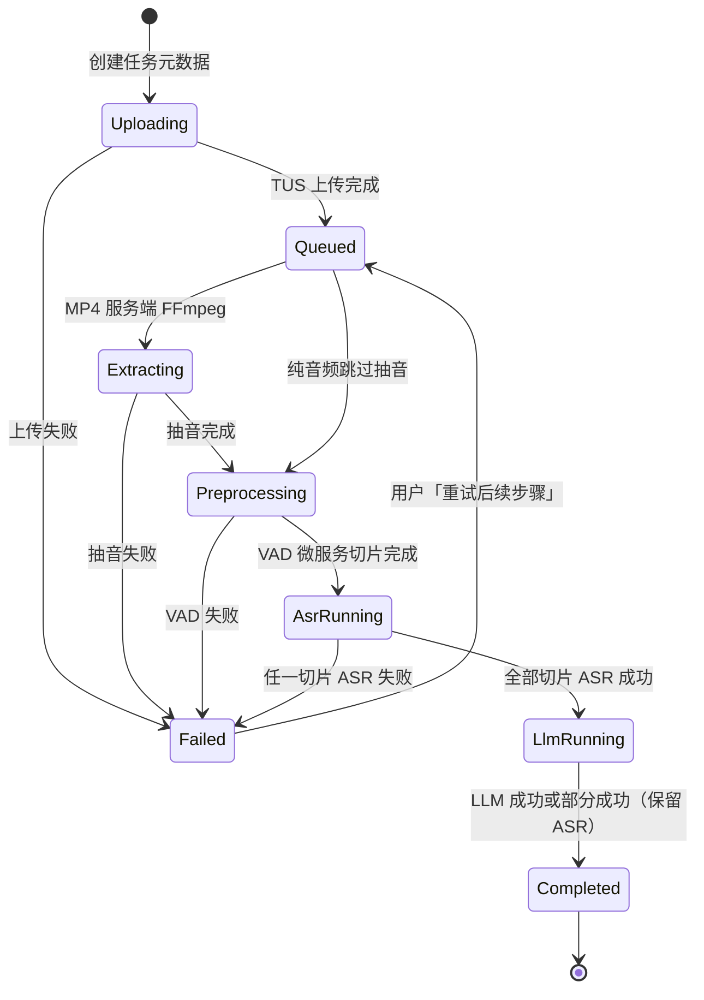

# LexOS 律所协作平台 — 产品需求文档（PRD）

| 字段 | 内容 |
|------|------|
| 文档版本 | v0.3 |
| 状态 | 草案 |
| 技术栈约束 | Node.js + Supabase；开发期使用线上 Supabase；**单律所私有化部署** |
| 产品名称 | **LexOS**（英文标识 LexOS） |

---

## 1. 系统定位与边界

### 1.1 核心解决的问题

LexOS 面向**单个律所**私有化部署场景，提供以 **AI 语音转写与文本后处理** 为核心的数字化协作能力，并配套 **企业级账户与权限、文件沉淀、模型与提示词可配置、操作审计**，使律师能够：

- 将庭审录音、客户访谈等音视频材料转为可编辑、可检索、可导出的法律相关文本；
- 在权限隔离前提下保存、检索历史材料，供后续业务功能复用；
- 由管理员统一配置 AI 能力、控制成本与可用性，满足人员流动与合规审计要求。

### 1.2 系统做什么（In Scope）

| 域 | 范围摘要 |
|----|----------|
| 用户与权限 | RBAC、账户启停、内置管理员初始化、个人中心、虚拟邮箱认证 |
| AI 基础设施 | 模型凭证、功能-模型映射、默认/兜底模型、Prompt 模板库（后台可配） |
| 律师端核心业务 | 分片直传存储、音视频预处理、异步转写任务、VAD 切片 ASR、LLM 后处理、工作台编辑与导出 |
| 文件与检索 | 个人云盘（目录/标签）、转写结果存储、全文检索；语义检索为规划能力 |
| 安全与审计 | 登录与关键资源操作日志；Postgres RLS + Storage Bucket 策略；强制改密闭环 |
| 呈现层 | 管理端/律师端等角色差异化侧边栏导航；高密度表格为主的工作区布局 |

### 1.3 系统不做什么（Out of Scope）

以下能力 **不在本 PRD 当前版本范围内**，除非后续单独立项并修订本文档：

| 排除项 | 说明 |
|--------|------|
| 多律所 SaaS / 多租户 | 本产品为**单律所私有化实例**；不提供多律所共用一套平台的租户隔离 |
| 案件全流程管理 | 无立案、排期、计费、法院对接等完整案件管理系统 |
| 电子签章 / 文书自动生成 | 除转写结果导出外，不承诺合同模板、送达、签章链路 |
| 即时通讯 / 协同编辑 | 无律所内部 IM、无多人实时共编同一文档 |
| 主任 / 客户 / 渠道商业务功能（首期） | 三角色已在系统中预留枚举，**首期无业务模块权限**，后续版本补充 |
| 移动端原生 App | 默认 Web（响应式或桌面浏览器）【待确认】具体适配范围 |
| 向量语义检索（首期） | 首期仅全文检索 |
| 用户自助找回密码 | 忘记密码须联系管理员重置，无邮件/短信自助链路 |
| 开放注册 | 仅管理员创建账户；匿名用户不可注册 |
| 邮件/短信网关 | 除 Auth 内部虚拟邮箱外，不依赖真实邮箱/短信 |
| 硬编码 Prompt | 业务 Prompt 由管理员在后台配置 |
| 浏览器端 FFmpeg / ffmpeg.wasm 抽音 | 长视频（近 1GB、最长 5h）在浏览器抽音易导致 OOM 与卡顿；**明确废弃** |

### 1.4 关键假设（已确认）

| 编号 | 内容 |
|------|------|
| A1 | **部署形态**：单律所私有化部署；一套实例服务一家律所 |
| A2 | **登录标识**：用户仅使用「用户名 + 密码」；通过虚拟邮箱映射接入 Supabase Auth（见 §2.5） |
| A3 | 内置管理员初始密码 `111111` 仅用于初始化；**首次登录强制改密**。管理员可将用户密码**一键重置为 `111111`**，且**重置后必须立即改密**（见 §2.4、§2.5.4） |
| A4 | 律师离职：**禁止物理删除账号**，仅允许「禁用」，以保留历史数据关联 |
| A5 | **律师数据范围**：律师仅能查看与操作**本人创建**的转写任务及关联文件（无「参与案件」跨人可见） |

---

## 2. 角色与权限（RBAC）

### 2.1 角色清单

| 角色 ID | 显示名 | 首期状态 | 描述 |
|---------|--------|----------|------|
| `anonymous` | 匿名用户 | 启用 | 未登录；仅访问登录等公开页；不可注册 |
| `admin` | 系统管理员 | 启用 | 用户/AI/审计/系统设置管理；**不可**浏览律师转写/云盘数据；首期 **无 MFA** |
| `lawyer` | 律师 | 启用 | 转写任务、个人云盘、全文检索（仅本人数据） |
| `director` | 律所主任 | **预留** | 占位页 + 个人中心只读 + 改密；首期无业务模块 |
| `client` | 客户 | **预留** | 同上 |
| `channel` | 外部渠道商 | **预留** | 同上 |

内置账户：`admin` 在系统初始化时存在，密码策略见 §1.4 A3。

### 2.2 功能模块与权限矩阵（首期）

图例：**C**=创建 **R**=查看 **U**=更新 **D**=删除 **—**=无权限 **\***=仅本人数据

| 模块 / 操作 | admin | lawyer | director | client | channel | anonymous |
|-------------|:-----:|:------:|:--------:|:------:|:-------:|:---------:|
| **用户管理** | | | | | | |
| 创建用户 | C | — | — | — | — | — |
| 查看用户列表 | R | — | — | — | — | — |
| 编辑用户（角色、资料） | U | — | — | — | — | — |
| 启用/禁用用户 | U | — | — | — | — | — |
| 重置他人密码为初始密码 | U | — | — | — | — | — |
| **个人中心** | | | | | | |
| 查看本人资料 | R | R | R | R | R | — |
| 修改本人密码（需原密码） | U | U | U | U | U | — |
| MFA 绑定/管理（TOTP） | — | — | — | — | — | — |
| **AI：模型凭证 / 映射 / Prompt** | CUD | — | — | — | — | — |
| 连通性测试 | R | — | — | — | — | — |
| **语音转写任务** | | | | | | |
| 发起上传/创建任务 | — | C\* | — | — | — | — |
| 查看任务列表与结果 | — | R\* | — | — | — | — |
| 编辑转写文本 | — | U\* | — | — | — | — |
| 导出 Word/PDF/TXT | — | R\* | — | — | — | — |
| 删除转写任务/结果 | — | D\* | — | — | — | — |
| **个人云盘 / 全文检索** | | | | | | |
| 目录/标签/文件管理 | — | CUD\* | — | — | — | — |
| 全文检索 | — | R\* | — | — | — | — |
| 下载文件 | — | R\* | — | — | — | — |
| **审计日志** | R | — | — | — | — | — |
| **系统配置（非 AI）** | CUD | — | — | — | — | — |

**说明：** `director` / `client` / `channel` 登录后进入占位页（文案见 `OPEN_ISSUES.md` PRD-2-04），可访问个人中心（只读）与改密。后续版本通过 PRD 修订扩展矩阵，不得破坏律师「仅本人数据」原则。

### 2.3 数据隔离原则（RLS）

- 所有业务表强制 **RLS**；禁止仅依赖前端隐藏。
- **`lawyer`**：`transcription_tasks`、`drive_nodes` 等核心表仅 `created_by = auth.uid()` 可读写。
- **`admin`**：**管理写**（用户/AI/系统设置）+ **审计只读**；**不可**读取律师转写/云盘业务数据（经 RLS 与 API 双重约束）。
- **预留角色**：首期不授予业务行访问；仅个人资料只读 + 改密。
- **跨律师访问**：首期不存在；主任「全局查看」待后续版本定义后再增策略。

#### 2.3.1 Supabase Storage Bucket 策略（已确认）

音频、视频及导出的 Word/PDF 等二进制对象存于 Supabase Storage。**除 Postgres RLS 外，必须在 Bucket 层配置访问策略**，防止通过拼接对象 URL 越权下载。

| 规则 | 说明 |
|------|------|
| 对象归属 | 每个对象元数据携带 `owner_id`（等于上传者 `auth.uid()`） |
| `SELECT`（读/下载） | 仅当 `auth.uid() = owner_id` 时允许；**admin JWT 无律师对象读路径** |
| `DELETE` | 同上；律师仅可删本人对象 |
| `INSERT` / `UPDATE` | 上传路径须使 `owner_id` 与当前用户一致；禁止客户端任意改写他人路径 |
| 签名 URL | 后端校验归属后签发；TTL **`STORAGE_SIGNED_URL_TTL_SEC=300`**（见 `architecture.md`） |

律师 **无法** 通过猜测 `storage path` 访问他人文件；策略与 §2.2 矩阵一致。

### 2.4 认证与账户字段（`profiles` 表）

| 字段 | 必填 | 说明 |
|------|:----:|------|
| 用户名 | 是 | 唯一标识；登录凭据；创建时查重 |
| 真实姓名 | 是 | 法律业务展示与审计 |
| 角色 | 是 | 枚举见 §2.1 |
| 联系方式 | 否 | 不参与找回密码 |
| 状态 | 是 | `enabled` / `disabled` |
| `requires_password_change` | 是（布尔） | 默认 `false`；管理员重置密码或等价操作时置 `true`；用户成功改密后置 `false` |

### 2.5 认证与安全（已确认）

#### 2.5.1 用户名 ↔ Supabase Auth：虚拟邮箱映射

Supabase Auth 要求 `email` 或 `phone` 作为唯一标识。LexOS 采用 **虚拟邮箱映射法**，对用户无感知：

| 步骤 | 行为 |
|------|------|
| 管理员创建用户 | 输入用户名 `lawyer_tom` → Node.js 转换为 `lawyer_tom@llexos.internal` |
| 写入 Auth | `supabase.auth.admin.createUser`，虚拟邮箱 + 初始密码 `111111` |
| 同步业务表 | Trigger 或后端写入 `profiles`：`user_id`、`username`、`display_name`、`role`、`requires_password_change`（默认 `false`） |
| 用户登录 | 输入 `lawyer_tom` → 前端或 BFF 拼接/查表为 `lawyer_tom@llexos.internal` → `signInWithPassword` |

约束：虚拟域 `@llexos.internal` 不可用于真实外发邮件；禁止用户自行修改虚拟邮箱。

#### 2.5.2 多因素认证（MFA）

> **首期决策（2026-05，已签收 PRD-2-03 / PRD-2.4-01）**：**全系统取消 MFA/TOTP**。`profiles.mfa_enabled` 字段保留，UI/API **不展示、不强制**；`MFA_REQUIRED_ROLES` 留空。以下为目标态参考，恢复时单独立项。

| 项 | 首期 | 目标态（后续） |
|----|------|----------------|
| 适用角色 | **无** | `admin`、`director` 等可配置 |
| 机制 | — | Supabase Auth TOTP |
| 登录流程 | 密码 → 业务/改密守卫 | 密码 → TOTP（强制角色）→ 业务 |

律师、客户、渠道商、admin 首期均 **不** 强制 MFA。

#### 2.5.5 会话持久化（已确认）

| 项 | 要求 |
|----|------|
| 用户感知 | 登录后 **长期有效**，除非主动登出或清除浏览器本地 token |
| Access token | 过期时前端经 `POST /api/auth/refresh` 静默续期（`api-client` / `SessionGuard`） |
| Refresh token | 存 `localStorage`；登出时清除 |
| 禁用用户 | 已登录会话在 **下一次** 带 Bearer 的 API 请求被拒绝（不 global signOut） |
| 重置密码 | 仍 `signOut(global)` + 强制改密（§2.5.4） |

Supabase 侧建议配置较长 refresh token 有效期；access JWT 可保持默认短 TTL，由 BFF refresh 对用户透明。

#### 2.5.3 锁号与防暴力破解

> **实施说明（2026-05）**：应用层图形验证码已关闭；仍保留 Supabase Auth 暴力破解防护。

| 层级 | 策略 |
|------|------|
| Supabase Auth | 仪表盘 **Security → Brute Force Protection**：同一账户连续输错 **5 次** → 锁定 **30 分钟** |
| 应用层 | 登录接口集成图形验证码（Cloudflare Turnstile 或 Geetest）；**连续输错 3 次**后强制弹出验证码 |
| 禁用账户 | 拒绝登录；与「不存在/密码错误」**同一提示**：`用户名或密码错误` |

#### 2.5.4 忘记密码与强制改密闭环（已确认）

- **无自助找回**；用户联系管理员。
- 管理员 **一键重置密码为 `111111`** 时，后端须同时：
  1. 调用 Supabase Admin API 更新 Auth 密码；
  2. 将 `profiles.requires_password_change` 设为 **`true`**；
  3. 写入审计日志。
- **重置后强制立即改密**：弱口令 `111111` 不得用于正常业务访问。用户再次登录后，**在完成改密前**不得使用任何业务功能。
- **前端路由守卫（Router Guard）**：每次导航前读取 `requires_password_change`；若为 `true`，**强制重定向**至修改密码页，并隐藏/禁用业务侧边栏。
- **BFF 拦截**：`password-change-gate` 中间件白名单外返回 `AUTH_PASSWORD_CHANGE_REQUIRED`；**不在** Controller 层重复校验。
- 用户在改密页提交新密码且校验通过后：更新 Auth 密码 → `requires_password_change = false` → 方可进入业务区。
- 内置 `admin` **首次登录**仍按 §1.4 A3 强制改密（可与 `requires_password_change` 共用同一改密页逻辑）。

---

## 3. 核心业务流（Core Workflows）

### 3.1 用户生命周期（管理员）

#### Happy Path

1. 管理员登录（已通过首次改密）。
2. 填写用户名、真实姓名、角色、可选联系方式 → 用户名唯一校验 → `createUser`（虚拟邮箱）+ 写入 `profiles`。
3. 线下交付初始凭据；用户首次登录强制改密（admin 账户）。
4. 禁用账户：禁止新会话；已登录用户 **下一请求** 失效（见 §2.5.5）；历史数据保留。禁止删除用户。

#### Edge Cases

| 场景 | 预期行为 |
|------|----------|
| 用户名重复 | 创建失败，不部分写入 |
| 禁用正在会话中的用户 | **下一 API 请求** 返回 `AUTH_ACCOUNT_DISABLED`；禁用时不 global signOut |
| 尝试删除用户 | 拒绝；仅禁用 |
| 禁用最后一个 admin | 拒绝 |
| 重置密码 | 设为 `111111`；`requires_password_change = true`；审计记录 |

#### 防错机制

- 用户名唯一索引 + 应用层预检。
- 禁用/重置：二次确认 + 审计。
- 内置 `admin` **不可被禁用**（API + UI 硬拒绝）。

---

### 3.2 登录与个人中心

#### Happy Path

1. 输入用户名 + 密码 → 解析虚拟邮箱 → `signInWithPassword`。
2. 输错密码达 3 次 → 要求验证码（首期验证码已关闭）；达 5 次 → Auth 层锁定 30 分钟。
3. 若 `requires_password_change = true` 或内置 `admin` 仍为初始密码 → **仅允许**访问改密页，Router Guard 拦截其他路由。
4. 按角色跳转：`lawyer` → 转写；`admin` → 管理首页；`director`/`client`/`channel` → 占位页（见 `OPEN_ISSUES.md` PRD-2-04）。
5. 个人中心：展示资料；预留角色资料**只读**；主动改密须验证原密码；成功后 `requires_password_change = false`。

#### Edge Cases

| 场景 | 预期行为 |
|------|----------|
| 忘记密码 | 提示联系管理员；无自助入口 |
| 锁定期间登录 | 明确锁定剩余时间或统一提示 |
| 预留角色登录 | 允许登录 → 默认 `/coming-soon` 占位页；个人中心只读 + 改密 |

#### 防错机制

- 密码强度：首期 **无** 复杂度要求（非空即可）；重置后的 `111111` 须配合强制改密。
- 会话：access token 过期时静默 refresh；**仅**登出或清除本地 token 后须重新登录（§2.5.5）。

---

### 3.3 AI 模型凭证与映射配置（管理员）

（流程同 v0.1；配置变更写审计。）

**功能点枚举（首期最小集）：**

| 功能点 KEY | 首期 | 说明 |
|------------|:----:|------|
| `asr_physical` | 是 | 语音转文字 - 物理层（声学 ASR） |
| `asr_semantic` | 否 | DB 枚举保留；**不单独调用**；听写后改顺由 `llm_transcript_polish` 承担 |
| `llm_transcript_polish` | 是 | LLM：标点、纠错、口语精简、分段（语义改顺） |
| `llm_legal_summary` | 是 | LLM：法律格式摘要 |

**兜底（已确认）：** 主模型失败 → 对该功能点配置的 `fallback_model_id` **重试 1 次**；**不**写 `audit_logs`；可记 `ai_invocation_logs`（`is_fallback=true`）。

---

### 3.4 Prompt 模板管理（管理员）

（流程同 v0.1；禁止律师端修改 System Prompt。）

---

### 3.5 语音转写任务（律师端核心）

#### 3.5.1 媒体约束与上传架构（已确认）

| 约束项 | 限值 | 实现策略 |
|--------|------|----------|
| 单文件大小 | **≤ 1 GB** | 前端校验；后端元数据二次校验 |
| 单文件时长 | **≤ 5 小时** | 前端/元数据校验；超长拒绝入队 |
| 上传路径 | **禁止**经 Node.js 以内存/整包接收文件 | 防止 OOM |
| 上传方式 | 前端 **分片上传** | Supabase Storage **Resumable Uploads（TUS）** 直传存储，绕过 Node 业务机 |
| 支持格式 | MP3, M4A, WAV, MP4 | 见下行 MP4 / 纯音频分支 |
| MP4 视频 | 庭审常见大体积 MP4 | **禁止浏览器端抽音**。TUS 直传 MP4 → Worker `media.extract` 抽音为 16 kHz/mono → **抽音成功后删除源 MP4**（PRD-3.5-01）；后续仅用音频对象 |
| 纯音频 | MP3, M4A, WAV | TUS 直传；必要时由服务端 FFmpeg 统一重采样至 16 kHz/mono |
| 长音频 ASR | Whisper 等单次窗口约 30s | **VAD 切片不在 Node 主进程执行**（见下行） |
| VAD 与切片 | CPU 密集 | **Node.js 仅负责任务状态机调度**（入队、状态迁移、回调）。**VAD 及音频切片**由 **独立 Python 进程** 或 **专用推理微服务** 执行，产出 ≤30s 片段列表后，再并行送入 ASR；避免阻塞 Node 事件循环导致登录/查询不可用 |
| 进程职责 | — | Node：I/O、鉴权、元数据、队列调度；Python/微服务：VAD、可选 Diarization；FFmpeg：抽音/重采样（子进程或 Worker） |

**任务创建 Happy Path：**

1. 律师选择文件 → 前端校验格式、≤1 GB、时长≤5 h。
2. TUS 分片直传 Supabase Storage（MP4 传原视频；音频传原文件）→ Node 仅接收对象 key/元数据，创建任务记录（`owner_id` 写入 Storage 策略字段）。
3. 若为 MP4 → 任务进入 `抽音中` → 服务端 FFmpeg 生成音频对象 → 更新任务音频 key。
4. 状态：`上传中` → `排队中` → `抽音中`（仅 MP4）→ `预处理/切片中`（VAD 微服务）→ `ASR识别中` → `LLM优化中` → `完成`/`失败`。
5. 物理切片 → 并行 ASR（`asr_physical`）→ 合并全文；可选 `max_speakers`（留空不限制，PRD-3.5-02）。
6. **整篇** LLM 润色（`llm_transcript_polish`）与 **整篇** 法律摘要（`llm_legal_summary`）→ 工作台编辑、导出。
7. 结果自动归档至云盘 **`YYYY-MM-DD/任务名称/`**（见 §3.6）；律师可后续重命名目录。

#### Edge Cases

| 场景 | 预期行为 |
|------|----------|
| 超过 1 GB 或 5 h | 前端拦截；服务端拒绝 |
| TUS 上传中断 | 断点续传 |
| 抽音失败 | 任务 `failed`；记录原因 |
| 任一切片 ASR 失败 | **整任务 `failed`**（PRD-3.5-03） |
| LLM 润色/摘要失败 | 主模型失败 → `fallback` 重试 1 次；仍失败则 **`completed` + 部分成功标记**，保留 ASR；UI 可 **分项重试**润色/摘要（PRD-3.5-04） |
| 上传成功、后续步骤失败 | UI **重试后续步骤**（不重新上传，PRD-3.5-06/08） |
| 律师禁用 mid-task | 后端流水线继续；禁用后律师无法登录查看 |

#### 防错机制

- Outbox + Worker；UI **HTTP 轮询**（≥2s，PRD-3.5-05）。
- 失败任务 **`POST /api/transcription/tasks/:id/retry`**（`pipeline` / `polish` / `summary`）。
- Worker `/tmp` 切片任务结束即删，不加密（PRD-3.5-07）。

#### 任务状态机

---

### 3.6 个人云盘与全文检索

- 律师仅检索、管理**本人**文件与转写正文（Postgres RLS + Storage 策略，§2.3.1）。
- **默认目录规则（已确认）**：任务完成归档时，系统自动创建层级 **`YYYY-MM-DD/任务名称/`**（任务名称取创建时标题或文件名去扩展名；**不截断**，仅替换非法路径字符；超过 256 字符则归档失败）。
- **禁止**在云盘根目录直接堆砌文件；新建文件必须位于某目录下。
- **删除（已确认）**：律师可删除本人节点；**admin 可跨用户删除**律师云盘节点（须写 `file.delete` 审计）；admin 不可浏览/下载律师云盘内容。
- **命名与删除（已确认）**：同一父目录下 **不允许同级重名**；删除文件夹 **级联软删除** 全部子项，操作前须用户确认并提示级联范围。

---

### 3.7 审计与安全事件

- **记录**：登录成功、登出、改密、重置密码、用户管理、AI 配置变更、任务创建/完成/失败、文件下载/删除/导出等（写入 `audit_logs`）。
- **不记录**：登录失败（无 `auth.login_failure`、不记尝试用户名，PRD-3.7-01）。
- **保留期**：`audit_logs` **365** 天（`AUDIT_LOG_RETENTION_DAYS` / `system_settings.retention.days` 默认；超期分区 DETACH 冷归档，PRD-3.7-02）。

---

## 4. AI 模块专属需求

### 4.1 AI 交互场景一览

| 场景 ID | 触发方 | 输入 | 输出 | 所用能力 |
|---------|--------|------|------|----------|
| AI-01 | 管理员 | 模型配置 + 测试 | 连通性结果 | 轻量探测 |
| AI-02 | 律师 | 音频（≤5h，经 VAD ≤30s 片） | 带时间戳转写 + 说话人【待确认】 | ASR + Diarization |
| AI-03 | 律师 | ASR 文本 | 润色正文 | LLM + Prompt |
| AI-04 | 律师 | 润色正文 | 法律摘要 | LLM + Prompt |
| AI-05 | 系统 | 功能点调用失败 | 兜底模型重试 | 默认模型映射 |

### 4.2 非功能需求（AI 侧）

#### 4.2.1 响应延迟

| 操作 | 目标 | 说明 |
|------|------|------|
| 模型连通性测试 | P95 ≤ 10s | 超时判失败 |
| ASR | 与时长、并行度相关 | 5h 音频依赖 VAD 片数与 worker【待确认】RT |
| LLM 润色 | P95 ≤ 60s（单片/批次【待确认】） | 超长全文分片策略【待确认】 |
| 端到端 | 异步 | UI 展示阶段状态 |

#### 4.2.2 Token / 用量

- 记录：模型 ID、token/等价计量、耗时、是否兜底。
- 律师端是否展示用量【待确认】。
- 计费口径【待确认】。

#### 4.2.3 上下文窗口

- 超长转写：分片 + 合并【待确认】策略。
- ASR 合并后文本与 5h 上限一致规划【待确认】LLM 分片阈值。

#### 4.2.4 降级 / 熔断

| 级别 | 行为 |
|------|------|
| L1 | 功能模型失败 → 默认模型重试【待确认】次数 |
| L2 | 仍失败 → 任务失败，保留 ASR【待确认】 |
| L3/L4 | 熔断阈值与全站不可用提示【待确认】 |

私有化须支持替换 Base URL / 模型 / Key 指向内网服务【待确认】协议兼容清单。

### 4.3 说话人分离降级（已确认，原 M5）

当 Diarization 未能在置信区间内识别出独立声纹时：

1. **LLM 逻辑层**剔除说话人时间戳维度，将文本**合并为连续正文**输出；
2. 工作台**页面顶部**展示系统提示（固定文案）：

   > 音频声纹重叠严重，已降级为无区分文本展示

### 4.4 仍待确认的 AI 项

| 编号 | 项 |
|------|-----|
| M1 | ASR / Diarization 供应商选型 |
| M3 | 音文对齐时间戳精度 |
| M4 | 是否允许仅 ASR、跳过 LLM |

---

## 5. 非功能性需求（NFRs）

### 5.1 性能与并发（已确认规模）

| 指标 | 值 |
|------|-----|
| 活跃用户 | **50～100** |
| 日均转写任务 | 约 **10** 个/天（常态） |
| 轻量接口峰值 QPS | **10**（登录、用户信息、模型配置等） |

| 接口/能力 | QPS 预期 | 说明 |
|-----------|----------|------|
| 登录 / 会话 / 用户资料 | ≤ 10（峰值规划） | 见上表 |
| 模型配置读写 | ≤ 10 | 管理员低频 |
| 任务元数据创建 | 【待确认】 | 大文件不经 Node 收流；仅创建记录 |
| 任务状态查询 | 【待确认】 | 建议轮询间隔 ≥ 2s |
| 全文检索 | 【待确认】 | Postgres FTS 或外部引擎【待确认】 |
| 管理端用户列表 | ≤ 10 | 分页默认 **50** 条/页 |
| 云盘文件列表 | ≤ 10 | 分页默认 **50** 条/页 |

**通用要求（已确认）：**

- 列表**必须**使用 **Offset 或 Cursor 分页**；禁止无界全表拉取。
- **禁止**前端「长列表虚拟滚动」直连全表数据；所有列表经分页 API 加载。
- Node **不得**在主进程同步执行 VAD、FFmpeg 重计算或 ASR/LLM；仅调度与 I/O（§3.5.1）。

### 5.2 可维护性与审计

（核心审计事件表同 v0.1 §5.2.1；保留期与 SIEM【待确认】。）

### 5.3 私有化部署约束

| 能力 | 要求 |
|------|------|
| 部署模型 | **单律所私有化**；应用、Postgres、Storage、推理服务均可内网 |
| 对象存储 | S3 兼容（含 Supabase Storage / MinIO） |
| 大文件 | TUS 直传 Storage；Node 无大对象内存缓冲 |
| FFmpeg | **仅服务端**：Node 子进程或异步 Worker/边车；**禁止**浏览器 ffmpeg.wasm |
| VAD / 重计算 | 独立 Python 进程或推理微服务；与 Node API 进程隔离部署【待确认】拓扑 |
| 验证码 | Turnstile/Geetest 须支持私有化或内网替代【待确认】 |
| 大模型 / ASR | 凭证 Base URL 可指向内网；支持本地替换 |

开发期可使用线上 Supabase；交付以私有化拓扑为准。

### 5.4 安全与合规（补充）

| 项 | 要求 |
|----|------|
| 传输 | HTTPS（TLS 1.2+）【待确认】 |
| 存储加密 | 【待确认】 |
| API Key | 不明文日志；界面掩码 |
| RLS | Postgres 表 + Storage Bucket，与 §2.3、§2.3.1 一致 |
| 备份 RPO/RTO | 【待确认】 |

### 5.5 UI/UX 规范

| 项 | 要求 |
|----|------|
| 视觉 | 深蓝 / 藏青 / 高级灰；严谨、专业 |
| 布局 | 左侧角色侧边栏 + 右侧宽屏工作区 |
| 数据展示 | 高密度 Data Table |
| 无障碍 | WCAG【待确认】 |

---

## 附录 A：名词表

| 术语 | 定义 |
|------|------|
| LexOS | 本产品名称 |
| TUS | 可恢复上传协议；Supabase Storage Resumable Uploads |
| VAD | 语音活动检测；由 Python/微服务执行，产出 ≤30s ASR 安全片段 |
| Router Guard | 前端路由拦截；`requires_password_change` 时强制改密 |
| 虚拟邮箱 | `{username}@llexos.internal`，仅用于 Supabase Auth |
| RLS | Postgres 行级安全策略 |
| 兜底模型 | 功能绑定模型失败时使用的全局默认模型 |

## 附录 B：文档修订记录

| 版本 | 日期 | 说明 |
|------|------|------|
| v0.1 | — | 基于初始想法的首版 PRD |
| v0.2 | 2026-05-29 | 闭合：LexOS 品牌、单律所私有化、律师仅本人数据、三角色预留、1GB/5h 与 TUS 策略、用户规模与认证 |
| v0.3 | 2026-05-29 | 强制改密闭环与 `requires_password_change`；废弃前端 WASM 抽音；服务端 FFmpeg + Python/微服务 VAD；Storage Bucket RLS；禁用 mid-task 策略；云盘默认目录；Diarization 降级文案；列表 50 条分页与禁止全表虚拟滚动 |

---

**说明：** 文中仍标注 **【待确认】** 的条目需在后续评审闭合；已确认条目不得以实现方擅自变更。**v0.3** 已确认内容作为设计与开发的优先依据。
